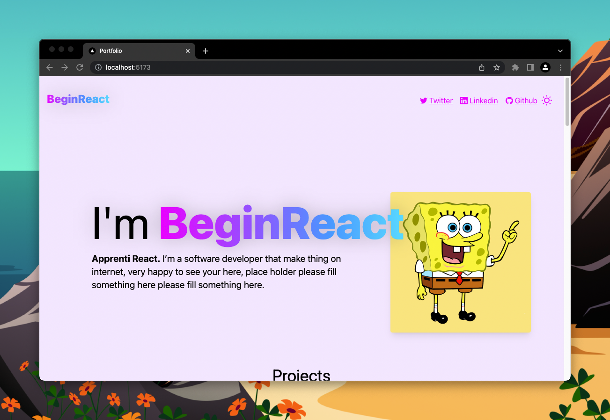
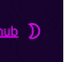

# Dark Mode

### Résultat

|               Light mode               |              Dark mode               |
| :------------------------------------: | :----------------------------------: |
|  |  |

Et le switch de thème ressemble à ça :

### Consignes

Tout site web qui se respecte a un dark mode.

J'ai simplifié la tâche pour toi.

Dans le fichier `/pages/_app.js` tu as une div avec l'id "app". Elle possède
la classe "dark". Si tu lui enlèves cette classe : boom ! Tout devient light.

Donc c'est dans ce fichier qu'on va gérer le dark-mode.

Mais comment ?

Tu vas devoir créer un context dans `src/context/ThemeProvider.jsx`. Celui-ci
aura un state `theme` qui devra pouvoir être récupéré partout dans l'app et aussi
"toggle" partout dans l'application.

Il y a un button, qui est déjà fait, pour changer le Theme qui se nomme :
`ToggleThemeButton.jsx`.

Quelques conditions :

- Si l'utilisateur change le theme, il doit être enregistré dans le localStorage.
- Par défaut, c'est le thème de l'ordinateur qui doit être utilisé, utilise [prefers color scheme](https://developer.mozilla.org/fr/docs/Web/CSS/@media/prefers-color-scheme)
- Si le thème par défaut de l'utilisateur change, il faut que le thème de l'application aussi
  sauf si l'utilisateur a défini le thème à la main, dans ce cas aucune modification n'est faite.

Pas clair ? Regarde la vidéo Intro et test la démo.

Hésite pas à aller check le site terminé : https://beginreact-workshop.vercel.app

⚠️ Avec NextJS aucun appel de localStorage ne doit être fait autre part quand
dans un useEffect !

### Tips

3 tips disponibles dans [TIPS.md](./TIPS.md)

### Fix le bug lors du chargement

Si tu as choisis dark mode, tu verras que lorsque tu refresh tu vois le light mode
puis boom il est remplacé par le dark mode.

Voici un article qui pourrait t'aidé à résoudre ce problème. https://www.joshwcomeau.com/react/dark-mode/

Mais trop compliqué pour un exercice !
