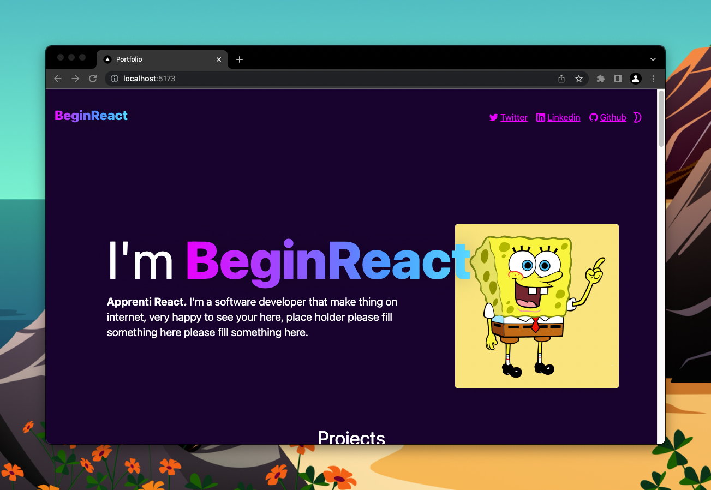

# Hero

### Résultat



### Consignes

Pour que tu apprennes à utiliser Tailwind, je te propose de faire
le seul exercice CSS de ce projet.

Je n'ai pas mis de layout (flex) dans le Hero, tu n'as qu'à recopier
la maquette Figma et gérer le responsive.

Pour ça tu peux lire [la doc de Tailwind sur le responsive](https://tailwindcss.com/docs/responsive-design).

Mais voici un petit exemple (je te conseille de ne gérer que le breakpoint `md`
dans le cadre de cet exercice).

```jsx
<div className="text-red md:text-blue">Hello</div>
```

(Si tu veux tester en live, voici [un lien pour tester tailwind](https://play.tailwindcss.com/LJrFJLhbhl))

Ici le seul but est la mise en forme !

Hésite pas à aller check le site terminé : https://beginreact-workshop.vercel.app

### Tips

Pas de tips disponible pour cet exercice.

Regarder la solution sur github.
