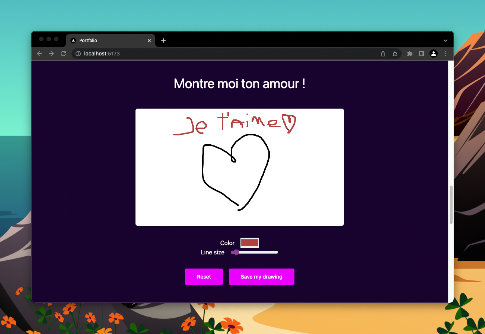

# Draw

## Résultat



## Instruction

Cet exercice est très intéressant.

On va ajouter un petit canva pour que les utilisateurs puissent dessiner sur notre portfolio.

Pour ça, on va utiliser beaucoup de `ref`.

Tu peux aller sur le site [final](https://beginreact-workshop.vercel.app) pour voir le résultat.

A la fin de cet exercice on pourra changer la
couleur du trait ainsi que l'épaisseur.

### Faire un dessin simple

Le but est déjà de faire fonctionner le canva.

Pour ça, tu peux aller dans le fichier `DrawCanvas`.
J'ai déjà crée la ref du canva dans le parent (oui on peut passer des ref d'un parent à un enfant), j'ai aussi crée 2 autres ref :

- `isDrawing` : pour savoir si on est en train de dessiner ou non
- `lastCoordinate` : permet de stoker la dernière coordonnée du curseur. Car on va toujours faire un trait entre la dernière et la nouvelle coordonnée, puis remplacer la dernière par la nouvelle.

Il y a 3 fonctions :

- `startDrawing` : qui va mettre `isDrawing` à `true` et mettre à jour `lastCoordinate`

- `stopDrawing` : qui va mettre `isDrawing` à `false`

- `draw` : qui va dessiner un trait entre la dernière coordonnée et la nouvelle. Pour ça il faut utiliser `getContext` sur le canva, puis `beginPath`, `moveTo`, `lineTo` et finalement `stroke()`. Enfin il ne faut pas oublier de mettre à jour `lastCoordinate`.

Pour récupérer les coordonée du cursuer par rapport au canva tu peux utiliser :

```js
const coordinate = getCoordinates(event, canvas.current);
```

Une fonction spécialement crée pour ça.

Il faut écouter un autre event, c'est `mouseup` sur l'élément window.

Tu as déjà vu comment ajouter un listener sur window, oublie pas de le retirer.

Lorsque cet event est appelé il faut appeler `stopDrawing`.

Le dernier truc à faire c'est de définir la size et la couleur de notre trait dans le composant draw.

Effectivement, pour préparer le prochain exercice, il faut ajouter ces informations dans le parent.

Dans le useEffect récupère le context 2d et ajoute y
un strokeStyle et un lineWidth. avec les constantes
définies dans ce fichier !

(TIPS 1 et 2)

### Gestion des couleurs et de la taille

J'ai crée un composant "DrawControl" pour éviter des
rerender on va juste lui passer une valeur par défaut et un callback pour chaque input.

Quand ces callback seront appelés, on va modifier le
context du canva et surtout la couleur et la taille.

Si ces explications ne sont pas claires, c'est normal.

Test, cherche et re-test.

Il n'y a pas qu'une seule solution et je ne veux pas t'imposer la mienne.

(TIPS 3)

### Reset et save button

J'ai ajouté un bouton reset et save.

Dans le reset il faut remettre le canva entièrement blanc. (google est ton ami)

Et le "save my drawing" va télécharger le canva en tant qu'image. (google est ton ami, ou les tips)

(TIPS 4)
