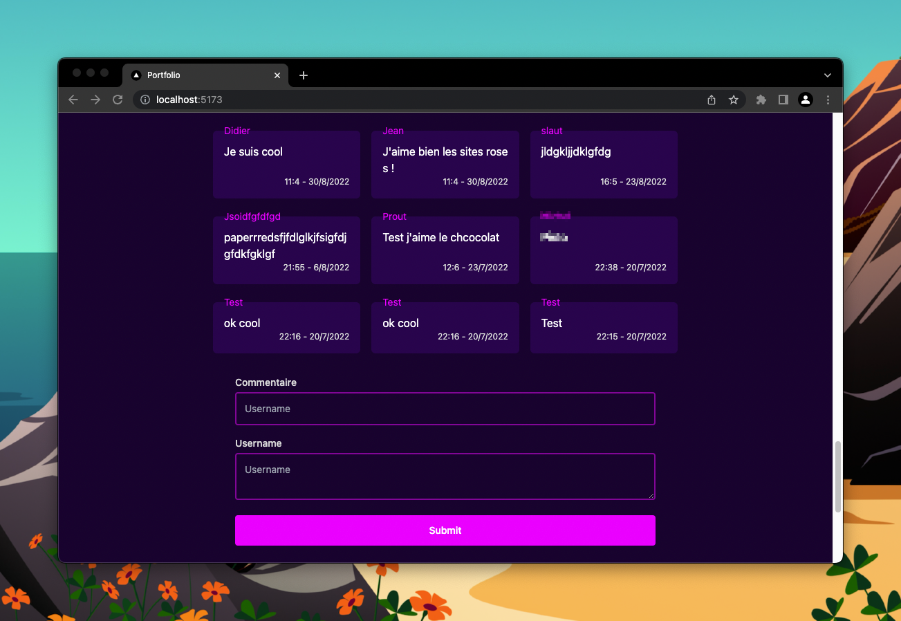

# Les commentaires

### Résultat

## Consignes

Les commentaires utilisent Notion. Vérifie que tu as bien setup
tous les Tokens dans le fichier `.env`.

J'ai déjà créé le composant Commentaire ainsi que le formulaire,
sans aucune logique.

Dans cet exercice tu vas devoir :

### Récupérer les commentaires.

1. tu peux utiliser le hook `useAsync` de l'exercice concernant les repository GitHub.
2. L'url pour récupérer les commentaire se trouve dans le fichier `api-url.js` et se nomme `commentsUrl`.

(TIPS 1)

### Afficher les commentaires !

Maintenant que tu as fetch les commentaires, il te suffit d'utiliser le composant
Commentaire pour les afficher correctement.

Mais il faut aussi afficher un loader.

Et si il y a une erreur il faut aussi l'afficher.

(TIPS 2)

### Ajouter un commentaire !

1. Tu vas devoir faire une fetch en utilisant `post` avec l'url `commentsUrl`.
2. Avant de faire le post, le username doit faire entre 4 et 20 caractères et le commentaire entre 10 et 100.
3. Je précise le body qu'il faut avoir dans le fichier `api-url.js`.
4. Attention, l'api renvoie des erreurs sous cette forme : `{error: "message"}`.
5. Il faut afficher cette erreur
   dans le formulaire. De plus il ne faut pas utiliser de state
6. Quand tu ajoutes un commentaire, il faut refresh la page des commentaires.

Comme dans l'exercice précédent, je ne t'offre que des tips en plus.

(TIPS 3)
